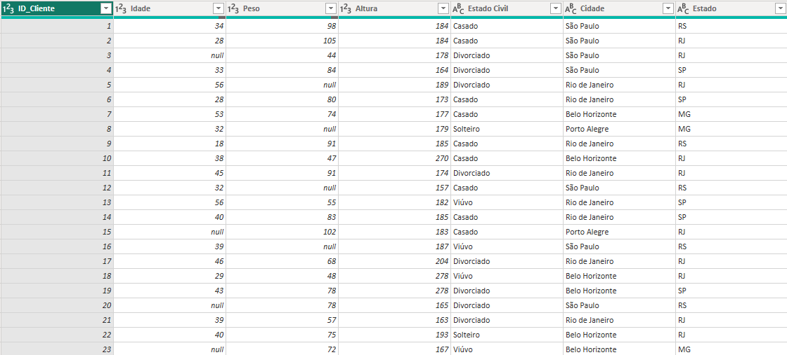
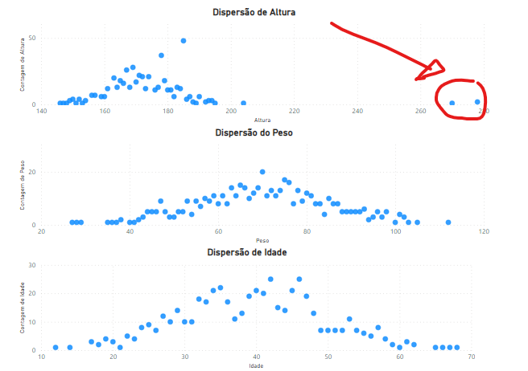
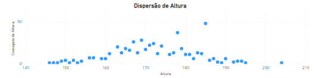

# Correção de Dados no PowerBI

## Identificamos alguns problemas na base de dados importada:

- 🔄 **Duplicatas na coluna `ID_Cliente`:** Cada cliente deveria ter um ID único, mas encontramos linhas duplicadas.
- ❌ **Valores ausentes em `idade` e `peso`:** Antes de qualquer análise, precisamos lidar com esses campos vazios.
- 📊 **Outliers na altura:** Observamos valores extremos na coluna de altura, que precisam ser tratados.
## Visão geral:

## Corrigindo problemas:

- ✨ **Removendo Duplicatas:** Com apenas um clique, podemos usar o PowerBI para remover todas as IDs duplicadas da coluna `ID_Cliente`.
- 📝 **Tratamento de Valores Ausentes:** Optaremos por substituir os valores ausentes pela mediana da idade (40 anos) e do peso (70 kg), uma solução prática e eficaz.
- 📏 **Correção de Outliers:** Decidimos substituir os outliers na idade pela mediana da altura (172 cm), eliminando valores extremos e mantendo a consistência dos dados.

## Demonstração Visual

|  |  |
|:---:|:---:|
| *Outliers* | *Após correção* |

## Contribuição

Contribuições são bem-vindas! Se você tiver sugestões de melhorias ou novas ideias, sinta-se à vontade para abrir uma issue ou enviar um pull request.

